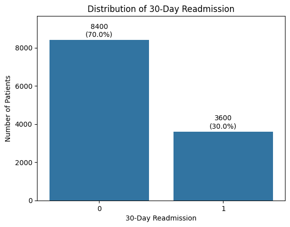
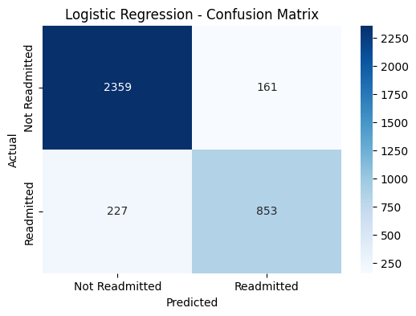
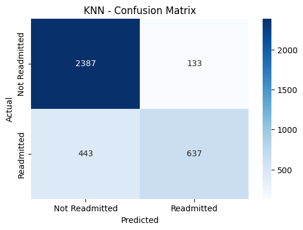
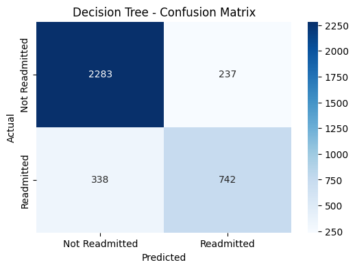
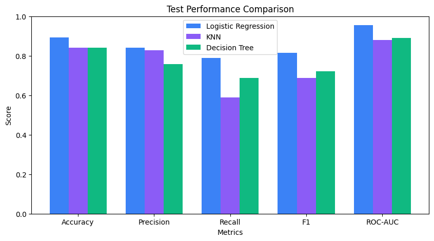
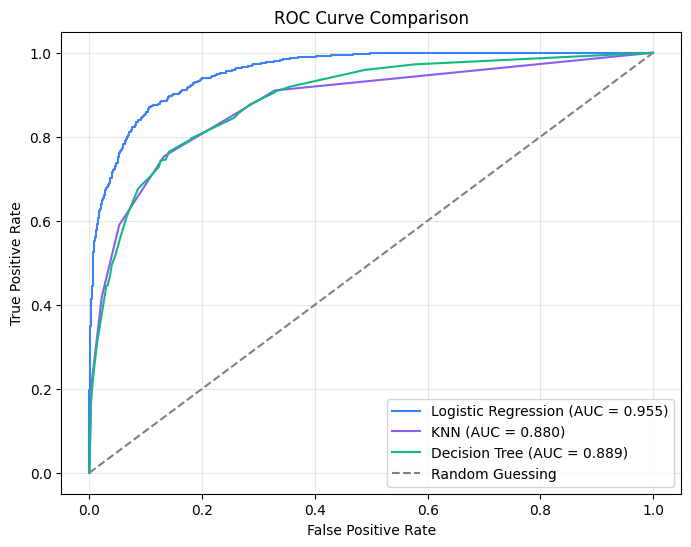
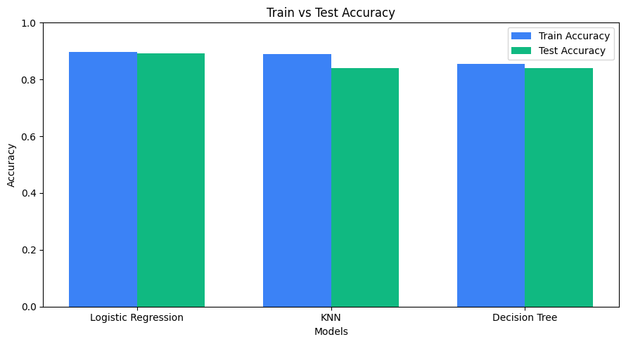

# Heart Failure 30-Day Readmission Prediction

A classical machine-learning project that predicts whether a heart-failure patient will be **readmitted within 30 days** of discharge. Three binary classifiers — **Logistic Regression**, **K-Nearest Neighbors (KNN)** and a **Decision Tree** — are trained on the same data split, tuned with cross-validation, and compared using several metrics rather than accuracy alone.

  

---

## Table of Contents

1. [Overview](#overview)
2. [Key Results](#key-results)
3. [Dataset](#dataset)
4. [Methodology](#methodology)
5. [Repository Structure](#repository-structure)
6. [Getting Started](#getting-started)
7. [Visualizations](#visualizations)
8. [Generalization Analysis](#generalization-analysis)
9. [Limitations](#limitations)
10. [Future Work](#future-work)

---

## Overview

Hospital readmissions within 30 days are costly and often avoidable. This project builds baseline models to flag patients at risk of readmission and studies how the models behave beyond headline accuracy.

**Objectives**

- Build and compare three classical binary classifiers on the same train/test split.
- Tune hyperparameters with cross-validation on the training set only (no repeated peeking at the test set).
- Evaluate with Accuracy, Precision, Recall, F1, ROC-AUC and confusion matrices.
- Compare training vs. test performance to assess overfitting.

---

## Key Results

Held-out test set (30% of data, stratified, `random_state=42`):

| Model | Train Acc. | Test Acc. | Precision | Recall | F1 | ROC-AUC |
|---|---|---|---|---|---|---|
| **Logistic Regression** | 89.64% | **89.22%** | **84.12%** | **78.98%** | **81.47%** | **95.49%** |
| KNN (k = 5) | 88.87% | 84.00% | 82.73% | 58.98% | 68.86% | 87.96% |
| Decision Tree (max_depth = 5) | 85.48% | 84.03% | 75.79% | 68.70% | 72.07% | 88.90% |

**Confusion matrices** (positive class = readmitted):

| Model | TN | FP | FN | TP |
|---|---|---|---|---|
| Logistic Regression | 2359 | 161 | 227 | 853 |
| KNN | 2387 | 133 | 443 | 637 |
| Decision Tree | 2283 | 237 | 338 | 742 |

**Takeaways**

- Logistic Regression gave the strongest results on every reported metric in this experiment, with a train–test accuracy gap of only 0.42 percentage points.
- KNN has fairly high precision but the lowest recall (it misses the most readmitted patients) and the largest train–test gap (4.87 points).
- The Decision Tree recovers more readmissions than KNN but with lower precision.

> These conclusions apply to this dataset and split only. They do not show that Logistic Regression is the best model for other datasets or for clinical use.

---

## Dataset

| Item | Detail |
|---|---|
| File | `dataset_12000_records.csv` |
| Records | 12,000 |
| Target | `Readmitted_30_Days` (1 = readmitted within 30 days, 0 = not readmitted) |
| Class balance | ≈ 70% class 0 / ≈ 30% class 1 (moderately imbalanced) |
| Dropped column | `Patient_ID` (identifier with no predictive meaning) |
| Missing values | None |

---

## Methodology

### Preprocessing
1. Removed `Patient_ID`.
2. One-hot encoded all object-type (categorical) columns with `drop_first=True`.
3. Split data 70/30 with `stratify=y` and `random_state=42`.
4. Fitted `StandardScaler` on the **training data only**, then applied it to both train and test sets to avoid data leakage.

### Models and tuning

| Model | Input | Tuning (5-fold CV, scored by F1) | Selected |
|---|---|---|---|
| Logistic Regression | Scaled | None (`max_iter=1000`, `random_state=42`) | — |
| KNN | Scaled | `k ∈ {3, 5, 7, 9, 11, 15, 21}` | k = 5 (CV F1 ≈ 0.6932) |
| Decision Tree | Unscaled | `max_depth ∈ {2, 3, 4, 5, 6, 8, 10, None}` | max_depth = 5 (CV F1 ≈ 0.7065) |

Scaling matters most for KNN (distance-based) and helps Logistic Regression; Decision Trees use threshold splits and do not need it.

### Evaluation
Accuracy, Precision, Recall, F1 and ROC-AUC on the held-out test set, plus confusion matrices and a train-vs-test accuracy comparison. F1 was used for tuning to balance precision and recall on the minority (readmitted) class.

---

## Repository Structure

```
.
├── Heart_Failure_30_Day_Readmission_Prediction.ipynb   # Full analysis notebook
├── Heart_Failure_30_Day_Readmission_Project_Report.pdf # Written report with Q1–Q14 analysis
├── dataset_12000_records.csv                           # Dataset (add locally)
└── README.md
```

---

## Getting Started

### Prerequisites
- Python 3.8+
- Jupyter Notebook or JupyterLab

### Installation

```bash
git clone <your-repo-url>
cd <your-repo-folder>

pip install pandas numpy scikit-learn matplotlib seaborn jupyter
```

### Run

```bash
jupyter notebook Heart_Failure_30_Day_Readmission_Prediction.ipynb
```

Run all cells in order. The notebook loads the data, preprocesses it, trains and tunes the three models, prints metrics and produces all plots.

---

## Visualizations

### Target Distribution


### Confusion Matrices

| Logistic Regression | KNN | Decision Tree |
|:---:|:---:|:---:|
|  |  |  |

### Test Metrics Comparison


### ROC Curve Comparison


### Train vs. Test Accuracy

---

## Generalization Analysis

| Model | Train Acc. | Test Acc. | Gap | Interpretation |
|---|---|---|---|---|
| Logistic Regression | 89.64% | 89.22% | 0.42 pts | No obvious overfitting |
| KNN | 88.87% | 84.00% | 4.87 pts | Some evidence of overfitting |
| Decision Tree | 85.48% | 84.03% | 1.45 pts | No strong evidence of severe overfitting |

No model shows clear underfitting based on accuracy.

---

## Limitations

- Results come from a **single train/test split** and may vary with a different sample.
- Classes are moderately imbalanced, and no resampling or class weighting was applied.
- The models are classical baselines and may miss complex feature interactions.
- A default 0.5 classification threshold was used; it was not tuned to the cost of false negatives vs. false positives.
- Strong predictive metrics do not imply clinical readiness. Deployment would require external validation, calibration and clinical review.

---

## Future Work

- Use repeated or stratified cross-validation and test on independent data.
- Compare class-imbalance strategies (class weights, SMOTE, threshold moving).
- Choose the decision threshold based on the practical cost of missed readmissions vs. unnecessary interventions.
- Add PR-AUC and calibration analysis.
- Try stronger models (e.g., Random Forest, Gradient Boosting) and interpretability tools such as feature importance or SHAP.
- Perform external and clinical validation before any real-world use.

---

## Disclaimer

This project is for educational and research purposes only. It is not a medical device and must not be used to make clinical decisions.
